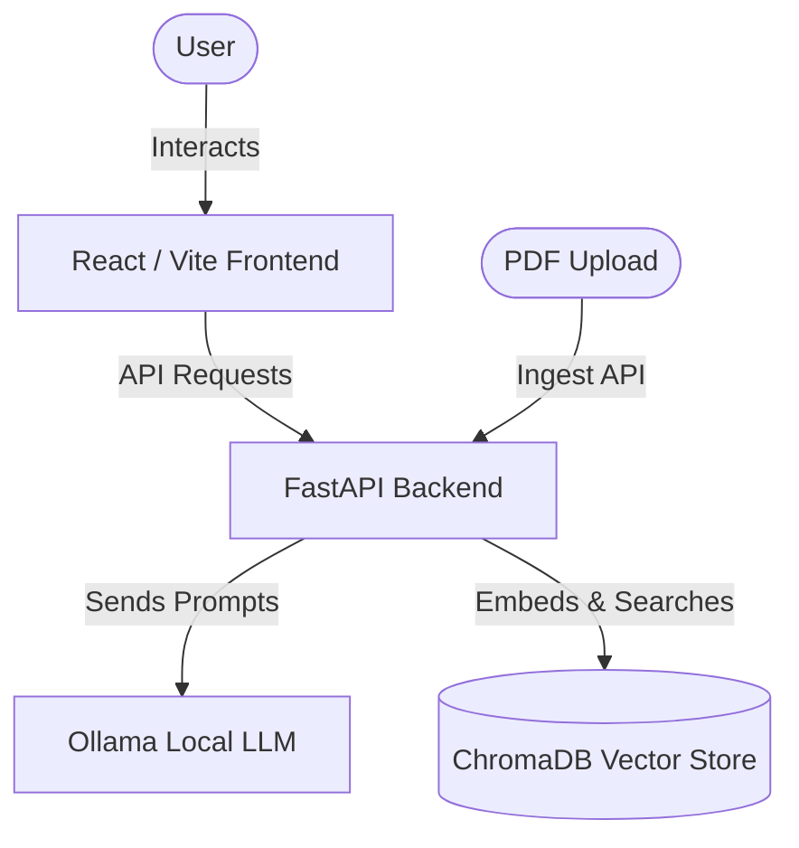

# Aromin AI: My Personal Career AI

Aromin AI is a **self-hosted, privacy-first AI chatbot** designed specifically for **recruiters and hiring managers** to ask questions about my career, experience, and life. Powered by local LLMs via Ollama and Retrieval-Augmented Generation (RAG), it allows users to interact with my resume and other professional documents as if they were talking directly to me. 

Because it runs entirely on local hardware, all interactions remain private and no data is ever sent to third-party APIs.

---

## What This Is

At its core, Aromin AI is an interactive, AI-powered representation of my professional background. Instead of just reading a static resume, recruiters and hiring managers can ask natural questions and get immediate, context-aware answers grounded in my actual documents.

Key features include:
- **100% Local Execution**: Runs entirely on your own hardware using Docker and Ollama.
- **Document Grounding (RAG)**: The AI's responses are based specifically on the PDFs you upload.
- **Real-time Streaming**: Responses stream in real-time.
- **Secure by Default**: The ingestion API is protected by a mandatory API key.

---

## How It Works

Aromin AI uses a modern, full-stack architecture to process documents and serve chat responses:



1. **Document Ingestion**: When you upload a PDF, the backend extracts the text, splits it into smaller overlapping chunks, and converts those chunks into numerical embeddings using Ollama (`nomic-embed-text`). These embeddings are stored locally in a ChromaDB vector database.
2. **Retrieval**: When you ask a question, your prompt is converted into an embedding. The backend searches ChromaDB for the most relevant chunks of text from your uploaded documents.
3. **Generation**: The backend combines your original question with the retrieved document chunks and sends them to the local LLM (`gemma3n:e2b` via Ollama) with a system prompt instructing the AI to answer based *only* on the provided context.
4. **Streaming Response**: The LLM generates the answer, which is streamed back through the backend to the React frontend in real-time via Server-Sent Events (SSE).

---

## How to Set It Up Locally

### Prerequisites

Before you begin, ensure you have the following installed on your machine:
- [Docker](https://docs.docker.com/get-docker/) and Docker Compose
- At least 4 GB of free disk space (to download the local AI models)
- Git

### 1. Clone the repository

```bash
git clone <your-repo-url>
cd aromin_ai
```

### 2. Configure Environment Variables

Copy the example environment file to create your own `.env` file:

```bash
cp .env.example .env
```

Open `.env` in a text editor. You **must** set the following variables:
- `INGEST_API_KEY`: A secure password/token of your choosing. This is required to upload documents so unauthorized users can't ingest files.
- `DEFAULT_SYSTEM_PROMPT`: Instructions for the AI persona (e.g., "You are a helpful assistant. Answer questions based only on the provided context.").

*(The other default variables in `.env` are pre-configured to work out-of-the-box for a local Docker setup).*

### 3. Start the Application

Run the following command to build and start the Docker containers in production mode (using an Nginx reverse proxy):

```bash
docker compose up --build -d
```

> **Note on First Run**: The first time you start the app, a setup script (`ollama_setup.sh`) will automatically run in the background to download the necessary AI models (`gemma3n:e2b` and `nomic-embed-text`) into the Ollama container. This download is several gigabytes and **may take several minutes** depending on your internet connection.

### 4. Access the App

Once the containers are running and the models have finished downloading, open your browser and navigate to:

**http://localhost:3000**

---

## Using the Application

### 1. Uploading a PDF

Before you can ask questions, you need to upload a document to the knowledge base. You can do this using `curl` or any API client (like Postman), targeting the `/api/ingest` endpoint:

```bash
curl -X POST http://localhost:3000/api/ingest \
  -H "Authorization: Bearer <YOUR_INGEST_API_KEY>" \
  -F "file=@/path/to/your/document.pdf"
```
*(Replace `<YOUR_INGEST_API_KEY>` with the key you set in your `.env` file, and `/path/to/your/document.pdf` with the actual path to your file).*

### 2. Chatting

Once the PDF is ingested, you can type your questions into the web interface at `http://localhost:3000`. The AI will search the uploaded document and stream the answer back to you.

---

## Development Mode

If you want to modify the code, you can use the development stack which features hot-reloading for both the backend and frontend.

```bash
cp .env.example .env.dev
# Edit .env.dev and add INGEST_API_KEY and DEFAULT_SYSTEM_PROMPT
docker compose -f docker-compose.dev.yml up --build
```
- Frontend: http://localhost:3000
- Backend API Docs: http://localhost:8000/docs
- Ollama API: http://localhost:11434
